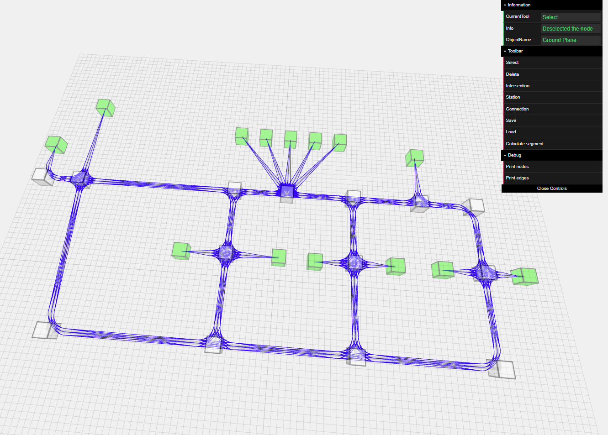

# Road Builder

Experimental road design and simulation tool running purly on the web browser.
- Three.Js using for rendering the scene in 3d space and for math library
- Typescript (TS) is added 
- Add webpack for ease of development (Hot reloading) and bundling for ease of deployment

See it in action https://youtu.be/Jm3xo-ZOVeM

## Example
